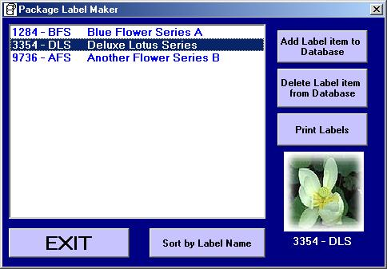



## Package Label Maker

### Description

This is a scaled down version of a Label Maker Program that I created for my employer. It uses Avery Labels 5162 but can be easily altered to fit other formats besides the 5162. This code demonstrates some very useful features for SELECTIVELY printing different colored borders around images as well as listbox functionality and utilizing Random file format to store data. If you like the program, Please vote for it. Thank you.

BTW, The following is needed for this to run correctly...

The Program looks for a folder called "LabelMaker" under the path C:\Program Files. If the folder is not there at startup. It will create one. There are 7 additional image files that need to be placed in the "LabelMaker" folder. They are Red.jpg, Blue.jpg, Green.jpg, Pink.jpg, Black.jpg, Gray.jpg, and NoPicAvail.jpg
 
### More Info
 
The Program looks for a folder called "LabelMaker" under the path C:\Program Files. If the folder is not there at startup. It will create one. There are 7 additional image files that need to be placed in the "LabelMaker" folder. They are Red.jpg, Blue.jpg, Green.jpg, Pink.jpg, Black.jpg, Gray.jpg, and NoPicAvail.jpg

             |
---                |---
**Submitted On**   |2001-01-06 01:14:40
**By**             |[Tim Roop](https://github.com/Planet-Source-Code/PSCIndex/blob/master/ByAuthor/tim-roop.md)
**Level**          |Intermediate
**User Rating**    |4.8 (19 globes from 4 users)
**Compatibility**  |VB 5\.0, VB 6\.0
**Category**       |[Complete Applications](https://github.com/Planet-Source-Code/PSCIndex/blob/master/ByCategory/complete-applications__1-27.md)
**World**          |[Visual Basic](https://github.com/Planet-Source-Code/PSCIndex/blob/master/ByWorld/visual-basic.md)
**Archive File**   |[CODE\_UPLOAD13440162001\.zip](https://github.com/Planet-Source-Code/tim-roop-package-label-maker__1-14177/archive/master.zip)

